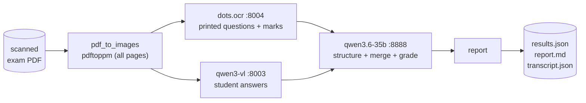

# wael-exames — local exam grading

Grades scanned NESA exam PDFs on the DGX Spark using a **hybrid local-LLM pipeline**:
`pdftoppm` render → **`dots.ocr`** reads the printed questions + marks → **`qwen3-vl`** reads
the student's answers (incl. circled options) → **`qwen3.6-35b`** structures + merges + grades
→ JSON + Markdown report. Using each model for what it's best at fixes mark mis-reading
*and* captures circled answers — neither single model managed both.



Inputs live in `in/` (`English paper.pdf`, `Math paper.pdf`, `SET paper.pdf`); grades are
written to `out/`. Full design with more diagrams: [`docs/ARCHITECTURE.md`](docs/ARCHITECTURE.md).

---

## Testing it against the 3 PDFs

### 0. Prerequisites (one-time)

- **Local tools:** `uv` (Python 3.12 manager), plus `pdftoppm` (poppler) and `magick`
  (ImageMagick). On macOS: `brew install uv poppler imagemagick`.
- **Install deps:** from the repo root, `uv sync` (creates the 3.12 venv and installs
  pydantic/httpx/pytest from `uv.lock`).
- **DGX models must be up.** The hybrid needs **three** endpoints (in `examgrader/config.py`)
  answering `200`:

      curl -s -o /dev/null -w "ocr:%{http_code}\n"    http://192.168.10.246:8004/v1/models  # dots.ocr
      curl -s -o /dev/null -w "vlm:%{http_code}\n"    http://192.168.10.246:8003/v1/models  # qwen3-vl
      curl -s -o /dev/null -w "grader:%{http_code}\n" http://192.168.10.246:8888/v1/models  # qwen3.6-35b

  `dots.ocr` (`:8004`) is **not part of the default production fleet** — start it before
  grading: `ssh dgx-spark 'docker start vllm-dots-ocr'` (it has memory headroom only when the
  box isn't full). qwen3-vl is `~/launch-qwen3-vl.sh`. A paper takes a few minutes (3 model
  calls per page, concurrency 2).

### 1. Grade all three at once

    ./grade_all.sh

This runs each paper and writes results under `out/`. (It just loops the single-paper
command below.)

### 2. Or grade one paper at a time

    uv run python grade.py "in/Math paper.pdf"    --subject Math
    uv run python grade.py "in/English paper.pdf" --subject English
    uv run python grade.py "in/SET paper.pdf"     --subject SET

`--subject` is optional (defaults to the file name); `--out DIR` changes the output folder
(default `out`).

### 3. Read the results

For each paper, three files appear in `out/`:

| File | What it is |
|------|-----------|
| `<paper>.report.md` | Human-readable: per-question marks, justification, ⚠ flags, total |
| `<paper>.results.json` | Same data as structured JSON (for downstream tooling) |
| `<paper>.transcript.json` | What the vision model *read* off each page (check OCR accuracy here) |

Quick look:

    cat "out/Math paper.report.md"

To sanity-check the handwriting reading, open the `*.transcript.json` and compare a few
answers against the scan — that isolates "did it read the page right" from "did it grade
right."

### 4. Run the unit tests (no DGX needed)

    uv run pytest

All LLM calls are mocked, so this runs offline and fast. Use it to confirm the code is
healthy before a live run.

---

## How it works

1. `examgrader/pdf_to_images.py` — `pdftoppm` renders **all** pages (sparse exam pages with
   big rough-work whitespace must not be dropped, or half the questions vanish).
2. `examgrader/dots_transcriber.py` — the hybrid transcriber, per page:
   - **`dots.ocr`** (`:8004`) faithfully transcribes the printed page;
   - `qwen3.6-35b` structures that into questions + `max_marks` (no answers);
   - **`qwen3-vl`** (`:8003`) is then asked for the student's answers to **those exact
     question numbers** (so circled/handwritten answers align), and they're attached.
   Section headers are carried across pages; one bad page/question is skipped, never the paper.
   `examgrader/markmap.py` reads the stated total and the report flags any mismatch.
3. `examgrader/grader.py` — the `MarkScheme` interface grades each question: `LLMJudge` by
   default, or `GuideMarkScheme` with `--guide` (deterministic, marking-guide-driven).
4. `examgrader/report.py` — writes the per-question JSON + a readable Markdown report.

The older single-model `qwen3-vl` transcriber (`examgrader/transcriber.py`) is kept but no
longer wired in — it over-read marks and couldn't see circled answers.

## Results (hybrid pipeline, 2026-06-23)

Every paper is scored on a normalized **0–100 scale** (`score_100 = 100 × awarded ÷
max_marks`) and is **reconciled** against the paper's own stated total: if detected marks
don't match, the report flags it. With the hybrid pipeline:

| Paper | Grade /100 | Questions | Blank answers | Marks checksum |
|-------|-----------|-----------|---------------|----------------|
| English | 64.8 | 63 | 1  | 91 / 100 (⚠ −9) |
| Math    | 58.5 | 55 | 0  | 94 / 100 (⚠ −6) |
| SET     | 67.0 | 63 | 0  | **100 / 100 ✓** |

The hybrid finally gets **both** right: marks are accurate and reconcile (vs the old single-VLM
145–187 over-read), and student answers are captured (0–1 blanks vs ~24 before). The small
remaining mark gaps (English 91, Math 94) are flagged by the checksum. For papers with stated
**section budgets** (English A/B/C/D) the report/CLI also show a **per-section** breakdown.

Caveat that still stands: these are the LLM-judge's grades of correctly-captured answers —
without an official answer key we can't *verify* the scores. The transcription foundation is
now solid; a **marking guide** (`--guide`) is what makes the grades themselves authoritative.

Targeted re-transcription of off-budget sections is available (`max_transcribe_passes > 1`)
but **off by default**: measured, it doesn't fix the VLM's *systematic* mark mis-reads
(re-reading reproduces them), so it mostly costs time. The diagnostic is the value. The
normalized `/100` keeps scores in range, but a flagged denominator is unreliable — the real
cure is a **marking guide** (`--guide`), which supplies the canonical marks. Treat
un-reconciled scores as a demonstration; LLM-judge grades also vary run-to-run.

## Performance

The hybrid makes **3 model calls per page** (dots.ocr OCR, question structuring, answer
reading) plus one grader call per question. Pages run through a thread pool at
`vlm_concurrency` (default **2** — three models share one box, so higher concurrency caused
request timeouts that silently dropped pages); grader calls at `grader_concurrency`. A paper
takes a few minutes. Cost wasn't optimized for — accuracy was.

## Flags in the report

- `blank_answer` — the student left it blank (a legitimate 0; informational only).
- `low_read_confidence` — handwriting was present but hard to read; **gets a ⚠** — check the
  scan against the transcript.
- `grading_failed` — the grader call errored for that question (scored 0); **gets a ⚠**.

The ⚠ marker fires only on review-worthy flags, not on blank answers.

## Marking guide (deterministic, accurate grading)

Grading runs behind a small `MarkScheme` interface. By default it uses **`LLMJudge`** (the
reasoning model decides the answer itself — flexible but non-deterministic). Pass `--guide`
to grade against an official **marking guide** instead:

    uv run python grade.py "in/Math paper.pdf" --guide "in/Math.guide.json"

The guide is a per-subject JSON file keyed by `question_no` with the authoritative answer
*and* marks per question (see the working example in [`in/Math.guide.json`](in/Math.guide.json)):

```json
{
  "1a": { "max_marks": 1, "answer": "False", "match": "exact_ci" },
  "3a": { "max_marks": 2, "accept": ["Circumference", "perimeter"], "match": "set" },
  "D1": { "max_marks": 15, "rubric": "content 6, grammar 5, structure 4", "match": "rubric" }
}
```

- `exact` / `exact_ci` / `set` → deterministic string compare (no LLM, reproducible) for
  objective questions.
- `rubric` → the LLM awards marks **bounded by the rubric**, for open-ended answers.
- Questions not in the guide fall back to `LLMJudge`.

Because the guide carries the canonical `max_marks`, it also pulls the denominator back to the
paper's true total. Full detail + diagrams:
[`docs/ARCHITECTURE.md` §7](docs/ARCHITECTURE.md#7-grading-strategy-the-markscheme-interface).

### Scaffold a full guide

Authoring a complete guide is just filling in answers. Generate a template from a transcript —
every question pre-listed with its marks, a default `match`, a blank `answer`/`rubric`, and the
student's transcribed answer as a `_student_answer` hint:

    uv run python scaffold_guide.py "out/Math paper.transcript.json"
    # -> in/Math paper.guide.template.json

Pre-scaffolded templates for the sample papers are in `in/*.guide.template.json`. Fill in the
authoritative answers (and set `match`/`accept`/`rubric` per question), rename to
`in/<subject>.guide.json`, and grade with `--guide`. Questions ≥ 5 marks default to the
`rubric` match type; the `_student_answer` field is an authoring hint and is ignored by the grader.

### Reproducible grades

LLM-judged grading varies slightly between runs (vLLM at `temperature=0` is not
bitwise-deterministic). Two levers make grading reproducible:

- **A marking guide** — objective (`exact`/`exact_ci`/`set`) questions are graded by string
  compare and are identical every run; a *complete* guide is fully deterministic.
- **`--from-transcript`** — re-grade a saved `*.transcript.json` without re-running OCR, so
  grading sees the exact same input each time (and it's much faster):

      uv run python grade.py --from-transcript "out/Math paper.transcript.json" --guide "in/Math.guide.json"

## Known limitations (POC)

- **Mark attribution is noisy.** The vision model reads each question's "(N marks)" label
  imperfectly, so the raw denominator drifts from the paper's true 100 (e.g. English 141).
  This is now contained — `max_total` is derived from the paper and the headline grade is
  normalized to `/100`, so totals can no longer exceed 100 — but the denominator is only as
  accurate as the OCR. A marking guide (`--guide`) supplies the canonical marks and fixes it.
- **LLM-judge grading is not bitwise-deterministic** (vLLM batching at `temperature=0`). Use a
  marking guide for deterministic objective grading, and `--from-transcript` to fix the OCR
  input — see [Reproducible grades](#reproducible-grades). The `rubric` and fallback LLM paths
  remain best-effort.
- The vision model scales only ~2× concurrently (memory-bound at its current util); more
  speed needs lower DPI or more VRAM headroom for batching.
- LLM-judge grading is best-effort; production should use the official marking guide via a
  `MarkScheme` implementation.

## Notes

- Inputs are in `in/`, grades in `out/` — both committed to this repo, including the raw
  rendered page scans (`out/*_pages/`). ⚠️ These scans and the source PDFs contain pupils'
  names; this repo is public, so that personal data is committed publicly by request.
- Endpoints, model names, and render DPI live in `examgrader/config.py`.
- DGX serving details (the `qwen3-vl` container, memory tuning) are in
  `docs/superpowers/specs/2026-06-22-exam-grading-framework-design.md`.
