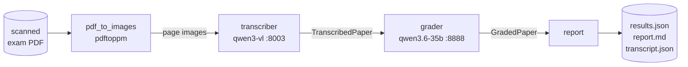

# wael-exames — local exam grading

Grades scanned NESA exam PDFs on the DGX Spark using a two-stage local-LLM pipeline:
`pdftoppm` render → `qwen3-vl` (handwriting transcription, port 8003) →
`qwen3.6-35b` (grading, port 8888) → JSON + Markdown report.

Inputs live in `in/` (`English paper.pdf`, `Math paper.pdf`, `SET paper.pdf`); grades are
written to `out/`. Full design with more diagrams: [`docs/ARCHITECTURE.md`](docs/ARCHITECTURE.md).

---

## Testing it against the 3 PDFs

### 0. Prerequisites (one-time)

- **Local tools:** `uv` (Python 3.12 manager), plus `pdftoppm` (poppler) and `magick`
  (ImageMagick). On macOS: `brew install uv poppler imagemagick`.
- **Install deps:** from the repo root, `uv sync` (creates the 3.12 venv and installs
  pydantic/httpx/pytest from `uv.lock`).
- **DGX models must be up.** Both endpoints in `examgrader/config.py` must answer `200`:

      curl -s -o /dev/null -w "vlm:%{http_code}\n"    http://192.168.10.246:8003/v1/models
      curl -s -o /dev/null -w "grader:%{http_code}\n" http://192.168.10.246:8888/v1/models

  If either is not `200`, the vision/grader container is stopped — restart on the DGX
  (`ssh dgx-spark`, then `~/launch-qwen3-vl.sh` for the vision model; see the design spec
  for the grader). Each paper takes ~2 minutes to grade.

### 1. Grade all three at once

    ./grade_all.sh

This runs each paper and writes results under `out/`. (It just loops the single-paper
command below.)

### 2. Or grade one paper at a time

    uv run python grade.py "in/Math paper.pdf"    --subject Math
    uv run python grade.py "in/English paper.pdf" --subject English
    uv run python grade.py "in/SET paper.pdf"     --subject SET

`--subject` is optional (defaults to the file name); `--out DIR` changes the output folder
(default `out`).

### 3. Read the results

For each paper, three files appear in `out/`:

| File | What it is |
|------|-----------|
| `<paper>.report.md` | Human-readable: per-question marks, justification, ⚠ flags, total |
| `<paper>.results.json` | Same data as structured JSON (for downstream tooling) |
| `<paper>.transcript.json` | What the vision model *read* off each page (check OCR accuracy here) |

Quick look:

    cat "out/Math paper.report.md"

To sanity-check the handwriting reading, open the `*.transcript.json` and compare a few
answers against the scan — that isolates "did it read the page right" from "did it grade
right."

### 4. Run the unit tests (no DGX needed)

    uv run pytest

All LLM calls are mocked, so this runs offline and fast. Use it to confirm the code is
healthy before a live run.

---

## How it works

1. `examgrader/pdf_to_images.py` — `pdftoppm` renders pages; near-blank scans are dropped.
2. `examgrader/transcriber.py` — sends each page to the vision model, which returns
   structured `{question, max_marks, student_answer, read_confidence}` records. A single
   unreadable page or question is skipped, never the whole paper.
3. `examgrader/grader.py` — the `MarkScheme` interface grades each question. The POC uses
   `LLMJudge` (the reasoning model decides correctness). Production swaps in a
   marking-guide implementation without touching the reading stage.
4. `examgrader/report.py` — writes the per-question JSON + a readable Markdown report.

## Results (all three graded, regenerated 2026-06-22)

The committed grades under `out/` are from this run:

| Paper | Total | Questions | Blank | Need review | Σ max_marks |
|-------|-------|-----------|-------|-------------|-------------|
| Math    | 68/100  | 38 | 0  | 0 | 88  |
| English | **119/100** | 75 | 30 | 0 | 170 |
| SET     | 66/100  | 57 | 1  | 0 | 114 |

**Caveat — totals can exceed 100.** English came out 119/100 because the transcriber
over-attributes marks: for multi-part questions it tags each sub-part with the parent's
"(N marks)" label, so the per-question `max_marks` sum to 170 on a /100 paper. Math (Σ=88)
and SET (Σ=114) show the same effect to a lesser degree. The objective Math transcription
still matched ground truth exactly (Q1 a–e, Q2, Q3a). Treat these numbers as a pipeline
demonstration, not final marks — see Known limitations. Scores also vary run-to-run because
the POC uses an LLM as judge.

## Performance

Transcription and grading both run their model calls concurrently (thread pool;
`vlm_concurrency` and `grader_concurrency` in `config.py`). Grader calls parallelize ~3.4×;
the vision model is GPU-bound on the single GB10 and scales ~2×, so transcription is the
dominant cost (~6 s/page). A full paper runs in roughly 75 s–2 min depending on page count.
Lowering `render_dpi` (200→150) is the cheapest further speedup if OCR accuracy holds.

## Flags in the report

- `blank_answer` — the student left it blank (a legitimate 0; informational only).
- `low_read_confidence` — handwriting was present but hard to read; **gets a ⚠** — check the
  scan against the transcript.
- `grading_failed` — the grader call errored for that question (scored 0); **gets a ⚠**.

The ⚠ marker fires only on review-worthy flags, not on blank answers.

## Known limitations (POC)

- **Mark over-attribution → totals can exceed 100.** The transcriber assigns the printed
  "(N marks)" of a multi-part question to *each* sub-part, so `max_marks` (and thus the
  awarded total) inflate past the paper's real maximum (English Σ=170 on /100). Fixing this
  needs the transcriber to attribute marks once per mark-bearing unit, and `max_total` to be
  derived from the paper rather than hardcoded to 100.
- LLM-judge scores vary between runs; not yet deterministic.
- The vision model scales only ~2× concurrently (memory-bound at its current util); more
  speed needs lower DPI or more VRAM headroom for batching.
- LLM-judge grading is best-effort; production should use the official marking guide via a
  `MarkScheme` implementation.

## Notes

- Inputs are in `in/`, grades in `out/` — both committed to this repo, including the raw
  rendered page scans (`out/*_pages/`). ⚠️ These scans and the source PDFs contain pupils'
  names; this repo is public, so that personal data is committed publicly by request.
- Endpoints, model names, and render DPI live in `examgrader/config.py`.
- DGX serving details (the `qwen3-vl` container, memory tuning) are in
  `docs/superpowers/specs/2026-06-22-exam-grading-framework-design.md`.
