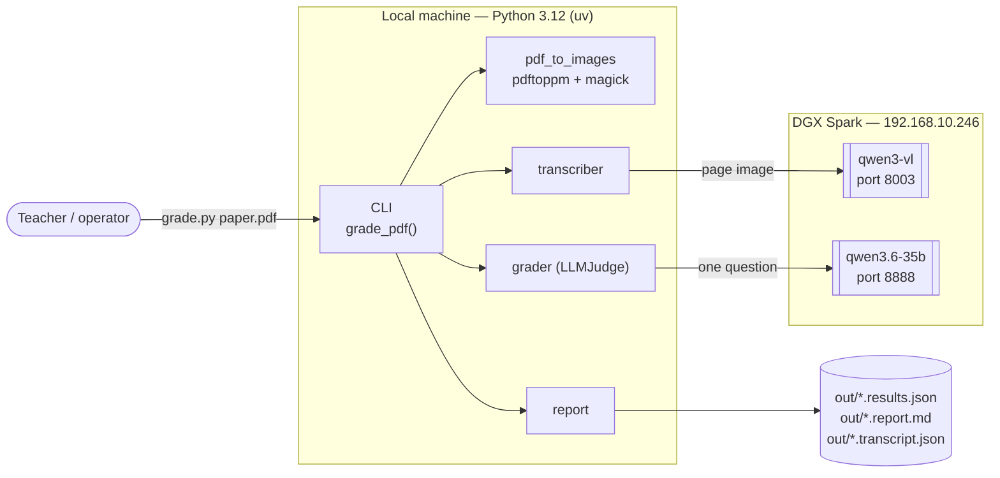
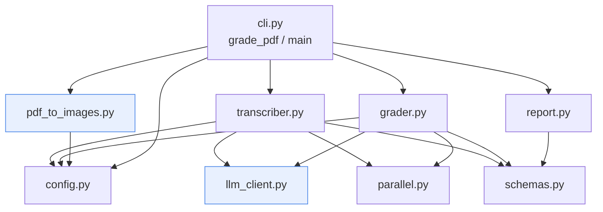
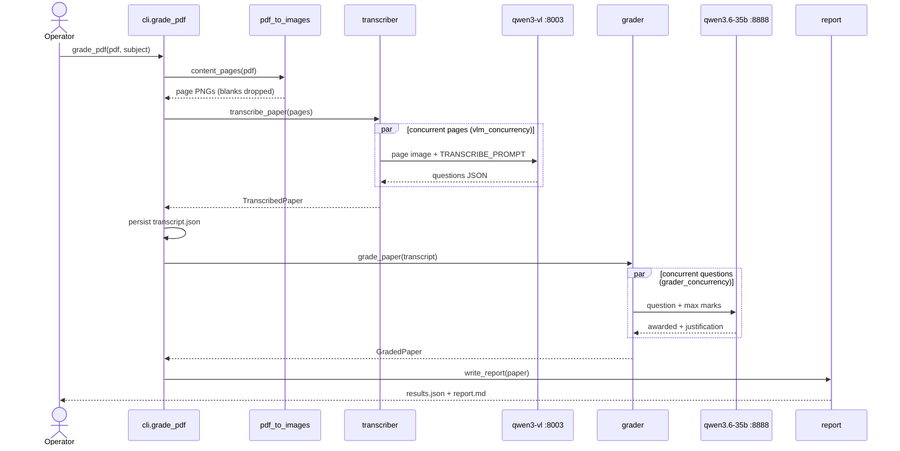
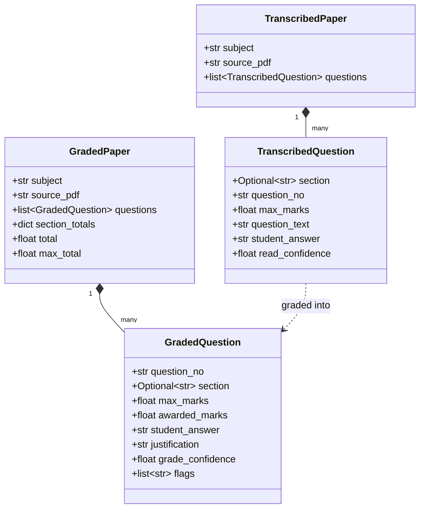
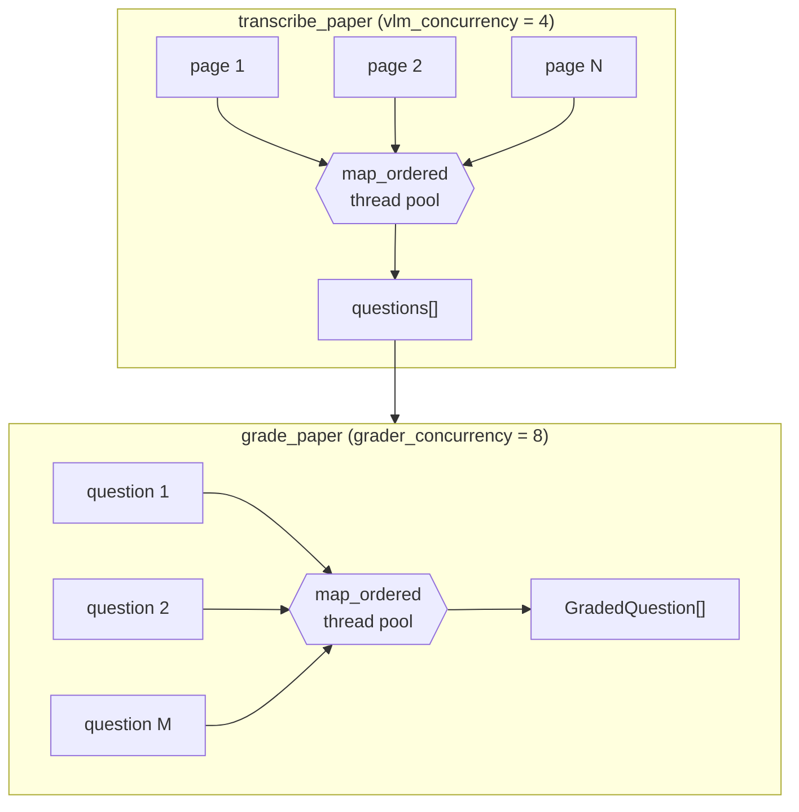
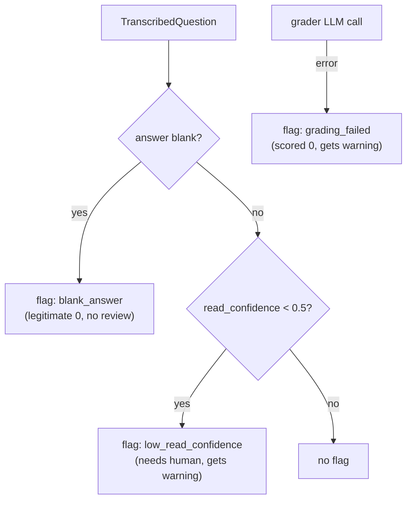
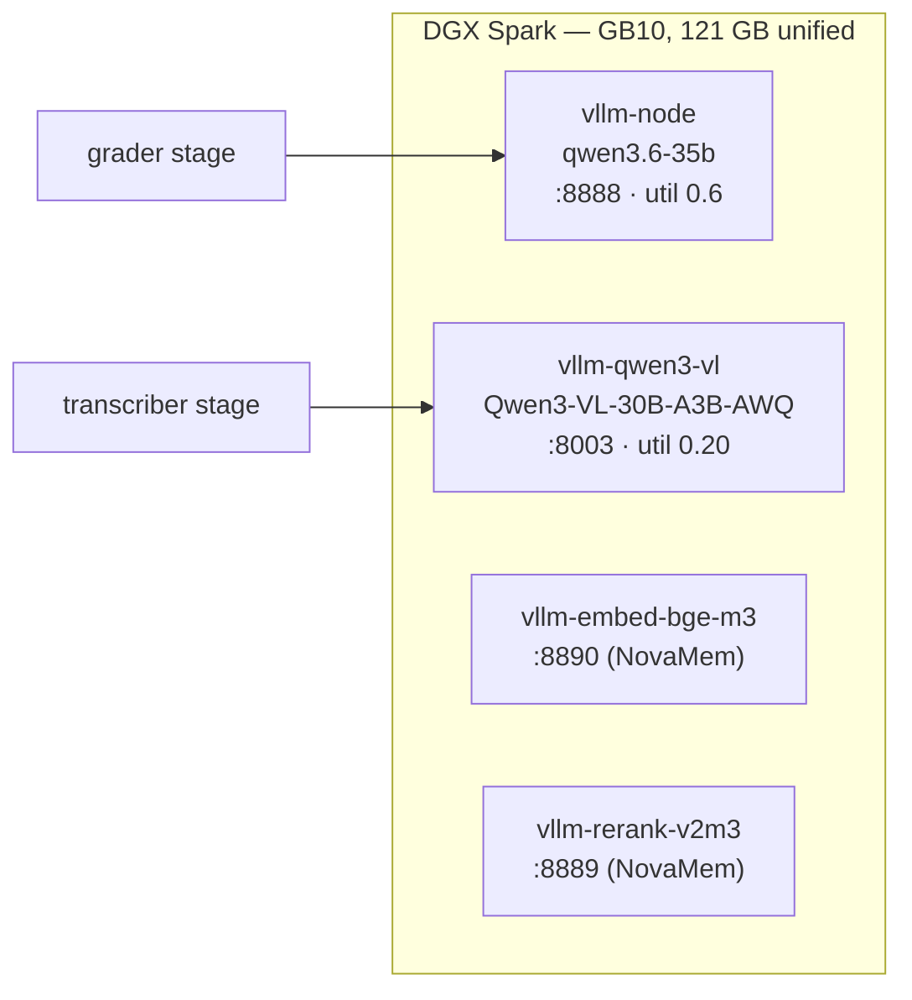

# Architecture — wael-exames

A local pipeline that grades scanned NESA exam PDFs entirely on the DGX Spark. It has two
model-backed stages separated by a typed boundary: **read** (a vision model transcribes
printed questions + handwritten answers) then **judge** (a reasoning model grades each
question). The judge sits behind a `MarkScheme` interface so the POC's LLM-as-judge can be
swapped for an official marking guide without touching the reading stage.

## 1. System context

The two models are pre-existing OpenAI-compatible vLLM endpoints on the DGX. Nothing leaves
the local network.

## 2. Module structure

Each module has one responsibility:

| Module | Responsibility |
|---|---|
| `config.py` | Endpoints, model names, render DPI, concurrency limits (frozen `Settings`) |
| `schemas.py` | Pydantic models that cross every stage boundary |
| `pdf_to_images.py` | Render pages with `pdftoppm`; drop near-blank scans (`magick` mean) |
| `llm_client.py` | OpenAI-compatible HTTP client: retry + JSON extraction + image/text parts |
| `parallel.py` | `map_ordered` — order-preserving thread-pool fan-out |
| `transcriber.py` | Page image → `TranscribedPaper` (vision model) |
| `grader.py` | `MarkScheme` interface + `LLMJudge`; `TranscribedPaper` → `GradedPaper` |
| `report.py` | `GradedPaper` → JSON + Markdown |
| `cli.py` | Orchestrates the pipeline; persists the transcript |

## 3. Pipeline sequence

The transcript is persisted **before** grading, so grading can be re-run without paying for
OCR again.

## 4. Data model (stage interfaces)

## 5. Concurrency model

Both stages fan their model calls out through `parallel.map_ordered`, which runs a
`ThreadPoolExecutor` and returns results in input order. Per-item isolation is preserved:
a failed page or question is skipped, never the whole paper.

Measured speedups: grader calls ~3.4×, vision calls ~2.0× (the vision model is GPU-bound on
the single GB10, so transcription dominates wall-clock).

## 6. Grading & flag semantics

`LLMJudge.grade_question` clamps awarded marks to `[0, max_marks]` and attaches a flag:

The report's warning marker fires only on review-worthy flags (`low_read_confidence`,
`grading_failed`) — never on a blank answer.

## 7. Deployment (DGX Spark)

Four vLLM containers share the GB10's 121 GB unified memory. The grader was tuned down to
util 0.6 and the vision model added at util 0.20 so all four coexist.

Full serving details (launch scripts, memory tuning, rollback container) are in
[`docs/superpowers/specs/2026-06-22-exam-grading-framework-design.md`](superpowers/specs/2026-06-22-exam-grading-framework-design.md).
